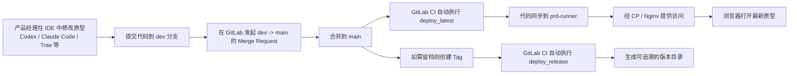

# 产品经理原型发布操作说明

## 1. 文档目的

本文档用于说明：当原型代码由产品经理独立维护时，如何从 GitLab 创建仓库开始，完成日常原型修改、代码提交、分支合并、自动发布和版本留档。

本项目已经打通自动化发布能力，产品经理不需要手动登录服务器发布文件。日常只需要在 `dev` 分支维护原型，定稿后合并到 `main`，系统就会自动发布最新版本；如果需要保留一个正式版本，再打一个 `tag` 即可。

## 2. 发布流程图



## 3. 分支规则

本项目建议只保留 2 个常用分支：

- `dev`
  作用：产品经理平时修改原型的工作分支
- `main`
  作用：线上最新版本分支

另外再配合使用：

- `tag`
  作用：对已经定版的版本做留档，方便后续追溯

请统一按下面规则执行：

- 平时所有原型修改都在 `dev` 分支完成
- 确认本轮原型已经定稿后，再把 `dev` 合并到 `main`
- 合并到 `main` 后，会自动发布最新版本
- 如果本次属于阶段定版或正式留档版本，再创建一个新的 `tag`

可以把它简单理解为：

- `dev` 是正在编辑的版本
- `main` 是当前对外可看的版本
- `tag` 是某个已经固定下来的历史版本

## 4. 一次性初始化

这一部分通常只在项目刚开始时操作一次。

### 4.1 在 GitLab 创建仓库

在 GitLab 中新建项目仓库时，建议按下面方式设置：

1. 进入 GitLab
2. 点击 `New project`
3. 选择创建空仓库或按团队规范创建项目
4. 填写项目名称，例如 `algo-vision-platform`
5. 创建仓库

创建完成后，建议确认：

1. 仓库里已经有当前原型代码
2. 仓库里已经有 `.gitlab-ci.yml`
3. 默认分支可设置为 `main`
4. 再额外创建一个 `dev` 分支，作为日常维护分支

如果仓库是第一次初始化，也建议做下面这一步：

1. 确保 `main` 作为发布分支保留
2. 从 `main` 创建 `dev`
3. 后续默认在 `dev` 上维护原型

### 4.2 当前项目的 GitLab CI 配置

为了便于产品经理理解“为什么合并到 `main` 会自动发布、为什么打 `tag` 会生成留档版本”，下面附上项目实际使用的 `.gitlab-ci.yml` 内容：

```yaml
stages:
  - deploy

default:
  tags:
    - prd-runner

variables:
  GIT_DEPTH: "0"
  DEPLOY_ROOT: /home/gitlab-runner/prototype
  PROJECT_PATH: ${DEPLOY_ROOT}/${CI_PROJECT_NAME}

deploy_latest:
  stage: deploy
  script:
    - rm -rf "${PROJECT_PATH}/latest"
    - mkdir -p "${PROJECT_PATH}/latest"
    - cp -r index.html "${PROJECT_PATH}/latest/"
    - '[ -d pages ] && cp -r pages "${PROJECT_PATH}/latest/" || true'
    - '[ -d assets ] && cp -r assets "${PROJECT_PATH}/latest/" || true'
    - '[ -d docs ] && cp -r docs "${PROJECT_PATH}/latest/" || true'
  rules:
    - if: '$CI_COMMIT_BRANCH == "main"'

deploy_release:
  stage: deploy
  script:
    - mkdir -p "${PROJECT_PATH}/releases"
    - |
      if [ -d "${PROJECT_PATH}/releases/${CI_COMMIT_TAG}" ]; then
        echo "Release already exists: ${PROJECT_PATH}/releases/${CI_COMMIT_TAG}"
        exit 1
      fi
    - mkdir -p "${PROJECT_PATH}/releases/${CI_COMMIT_TAG}"
    - cp -r index.html "${PROJECT_PATH}/releases/${CI_COMMIT_TAG}/"
    - '[ -d pages ] && cp -r pages "${PROJECT_PATH}/releases/${CI_COMMIT_TAG}/" || true'
    - '[ -d assets ] && cp -r assets "${PROJECT_PATH}/releases/${CI_COMMIT_TAG}/" || true'
    - '[ -d docs ] && cp -r docs "${PROJECT_PATH}/releases/${CI_COMMIT_TAG}/" || true'
  rules:
    - if: '$CI_COMMIT_TAG'
```

可以这样理解这份配置：

- 只要代码进入 `main`，就会触发 `deploy_latest`
- `deploy_latest` 会把当前站点内容发布到 `latest` 目录
- 只要创建 `tag`，就会触发 `deploy_release`
- `deploy_release` 会在 `releases/<tag>` 下生成一个独立版本目录
- 如果 `tag` 同名目录已经存在，流水线会直接失败，避免覆盖历史版本

### 4.3 本地打开项目

产品经理可以使用任意熟悉的 IDE 或 AI 编程工具打开项目，例如：

- Codex
- Claude Code
- Trae
- VS Code

首次使用时，建议按下面流程操作：

1. 将 GitLab 仓库克隆到本地
2. 用 IDE 打开项目目录
3. 确认当前分支为 `dev`
4. 先本地打开页面确认项目可正常预览

## 5. 日常维护流程

日常维护原型时，统一按下面流程执行。

### 5.1 在 IDE 中修改原型

平时修改原型时，请始终确认自己在 `dev` 分支。

产品经理常见的工作方式通常是：

1. 用 Codex、Claude Code、Trae 或其他 IDE 打开项目
2. 直接修改页面文案、结构、样式和页面配置
3. 本地打开页面检查效果
4. 确认修改内容符合预期后，再提交代码

建议每次至少自查以下内容：

- 首页是否能正常打开
- 本次修改页面是否能正常进入
- 页面样式是否正常
- 文案、图片、按钮、跳转是否正常
- 是否误影响其他页面

### 5.2 在 IDE 中提交代码

提交代码时，可以用两种方式：

- IDE 自带的 Git 可视化界面
- IDE 里的终端命令行

下面给出产品经理最容易照着操作的方式。

#### 方式一：使用 IDE 的 Git / Source Control 面板

适用于 Codex、Claude Code、Trae、VS Code 一类工具中带有 Git 面板的场景。

一般操作步骤如下：

1. 打开左侧 `Source Control`、`Git` 或 `版本管理` 面板
2. 查看本次修改过的文件
3. 确认修改无误后，点击 `Stage` 或 `+`
4. 在提交说明输入框填写本次变更说明
5. 点击 `Commit`
6. 点击 `Push`，把代码推送到远端 `dev` 分支

提交说明建议写清楚，例如：

- `调整仪表盘原型布局`
- `补充任务创建页交互`
- `修复首页跳转问题`

#### 方式二：使用 IDE 终端命令

如果你更习惯在工具内直接执行命令，也可以在终端里操作：

```bash
git checkout dev
git pull origin dev
git add .
git commit -m "调整仪表盘原型布局"
git push origin dev
```

说明：

- `git checkout dev`：切到 `dev` 分支
- `git pull origin dev`：先拉取远端最新代码
- `git add .`：加入本次改动
- `git commit -m "..."`：提交说明
- `git push origin dev`：推送到 GitLab

如果你使用的是 Windows 终端，也可以在 PowerShell 中执行同样的 Git 命令。

## 6. 在 GitLab 中发起合并

当 `dev` 上的本轮原型已经定稿后，需要把它合并到 `main`。

具体操作如下：

1. 打开 GitLab 仓库页面
2. 进入 `Merge requests`
3. 点击 `New merge request`
4. 选择源分支为 `dev`
5. 选择目标分支为 `main`
6. 填写标题和说明
7. 创建 Merge Request
8. 确认内容无误后，点击 `Merge`

建议 MR 说明至少写清：

- 本次改了哪些页面
- 本次改动的目的是什么
- 浏览器验收时重点看什么

对产品经理来说，这一步非常关键，因为：

- `dev` 上的代码只是“已完成编辑”
- 只有 `main` 上的代码才代表“已发布版本”

## 7. 合并后系统会自动发布

当前仓库的 GitLab CI 规则如下：

- 合并到 `main` 后，自动执行 `deploy_latest`
- 创建 `tag` 后，自动执行 `deploy_release`

也就是说：

- `dev -> main` 合并成功后，会自动发布最新版本
- 不需要手动上传文件
- 不需要手动登录 `prd-runner`
- 不需要手动改 Nginx

当前 `main` 分支发布的是以下内容：

- `index.html`
- `pages/`
- `assets/`
- `docs/`

### 7.1 发布后的访问路径示例

为了便于理解，下面用当前项目的真实访问地址举例说明。

#### 最新版本访问路径

当 `dev` 合并到 `main` 后，系统会把最新版本发布到 `latest` 目录。

 `main` 分支访问路径示例为：

`http://192.168.224.69:8088/AlgoVisionPlatform/latest/index.html`

这可以理解为：

- `AlgoVisionPlatform`：项目目录
- `latest`：当前最新发布版本目录
- `index.html`：浏览器访问入口

也就是说，只要 `main` 上有新的合并并且 `deploy_latest` 成功，这个地址打开的就是最新原型。

#### 定版版本访问路径

如果当前版本已经定版，并创建了 `tag`，系统会把版本发布到 `releases/<tag>` 目录。

 `V_1.0` 版本访问路径示例为：

`http://192.168.224.69:8088/AlgoVisionPlatform/releases/V_1.0/index.html`

这可以理解为：

- `AlgoVisionPlatform`：项目目录
- `releases`：历史版本目录
- `V_1.0`：本次定版时创建的 `tag`
- `index.html`：浏览器访问入口

也就是说：

- 看“当前最新版本”，访问 `latest/index.html`
- 看“某个已定版的历史版本”，访问 `releases/<tag>/index.html`

后续新增的版本只需要修改`V_1.0`版本号即可

## 8. 合并后在 GitLab 里怎么确认发布成功

请不要只看“MR 已合并”，还要再确认一次流水线。

具体操作如下：

1. 在 GitLab 项目页面进入 `Pipelines`
2. 找到刚刚由 `main` 触发的新流水线
3. 点击进入查看 Job
4. 确认 `deploy_latest` 状态为成功

如果 `deploy_latest` 成功，就代表最新原型已经完成自动发布。

如果失败，则说明代码虽然合并了，但线上版本还没有正常更新。

## 9. 发布后在浏览器里怎么验收

流水线成功后，再打开线上原型地址进行验收。

建议至少检查：

1. 首页是否能正常打开
2. 本次改动页面是否能正常进入
3. 样式、文案、图片是否正常
4. 按钮、弹窗、跳转是否正常

为了减少缓存影响，建议：

1. 浏览器强制刷新
2. 或使用无痕窗口打开

## 10. 定版后如何打 Tag

如果某个版本已经确认需要留档，例如：

- 评审定版
- 阶段里程碑版本
- 对外演示版本

就可以创建一个新的 `tag`。

建议命名示例：

- `v1.0.0`
- `v1.1.0`
- `2026-04-review`

### 10.1 在 GitLab 中创建 Tag

可以按下面步骤操作：

1. 进入 GitLab 项目页面
2. 打开 `Code` 或 `Repository`
3. 进入 `Tags`
4. 点击 `New tag`
5. 输入新的 `tag` 名称
6. 选择基准分支或基准提交，通常选择 `main`
7. 创建 Tag

创建后，系统会自动触发 `deploy_release`，生成一个可追溯的版本目录。

### 10.2 Tag 的使用规则

请注意：

- 同一个 `tag` 名称不要重复使用
- 已存在的版本目录不会被覆盖
- 如果想重新留档，请新建一个新的 `tag`

## 11. 推荐给产品经理的完整操作清单

每次维护和发布原型时，可以直接按下面清单执行：

1. 打开 IDE，并确认当前分支是 `dev`
2. 修改原型页面
3. 本地检查页面效果
4. 在 IDE 的 Git 面板或终端中提交代码
5. 推送 `dev` 到 GitLab
6. 在 GitLab 创建 `dev -> main` 的 Merge Request
7. 确认无误后合并到 `main`
8. 到 GitLab `Pipelines` 查看 `deploy_latest` 是否成功
9. 打开浏览器验收最新版本
10. 如果本次需要留档，再创建新的 `tag`

## 12. 常见异常处理

### 12.1 合并了，但线上没更新

优先检查：

1. 是否真的已经把 `dev` 合并到 `main`
2. GitLab 是否触发了新的 Pipeline
3. `deploy_latest` 是否成功

### 12.2 浏览器看到的还是旧页面

按下面顺序排查：

1. 确认 `deploy_latest` 已成功
2. 浏览器强制刷新
3. 使用无痕窗口重新打开
4. 确认访问的是正确的线上地址

### 12.3 Tag 发布失败

通常先检查：

- 是否使用了重复的 `tag` 名称

如果重复了，请换一个新的 `tag` 再创建。

## 13. 一句话总结

产品经理平时只在 `dev` 分支维护原型，定稿后通过 GitLab 把 `dev` 合并到 `main`，系统就会自动发布最新版本；如果要保留一个可追溯的正式版本，再在 `main` 上创建一个新的 `tag` 即可。
